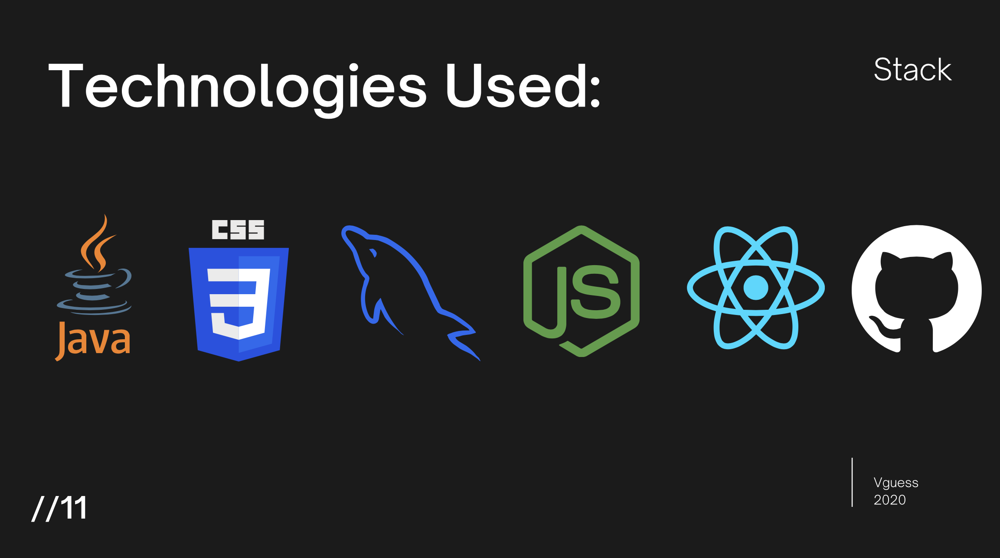
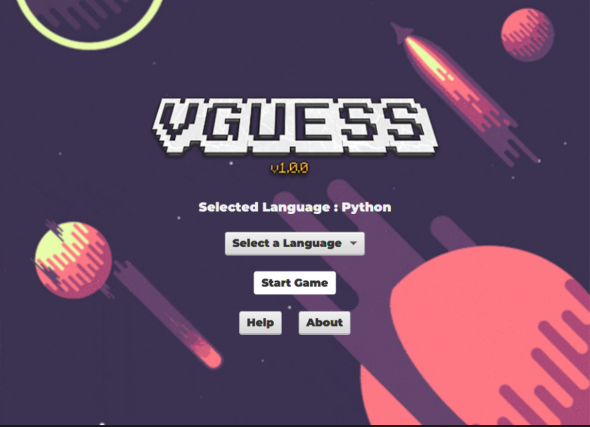
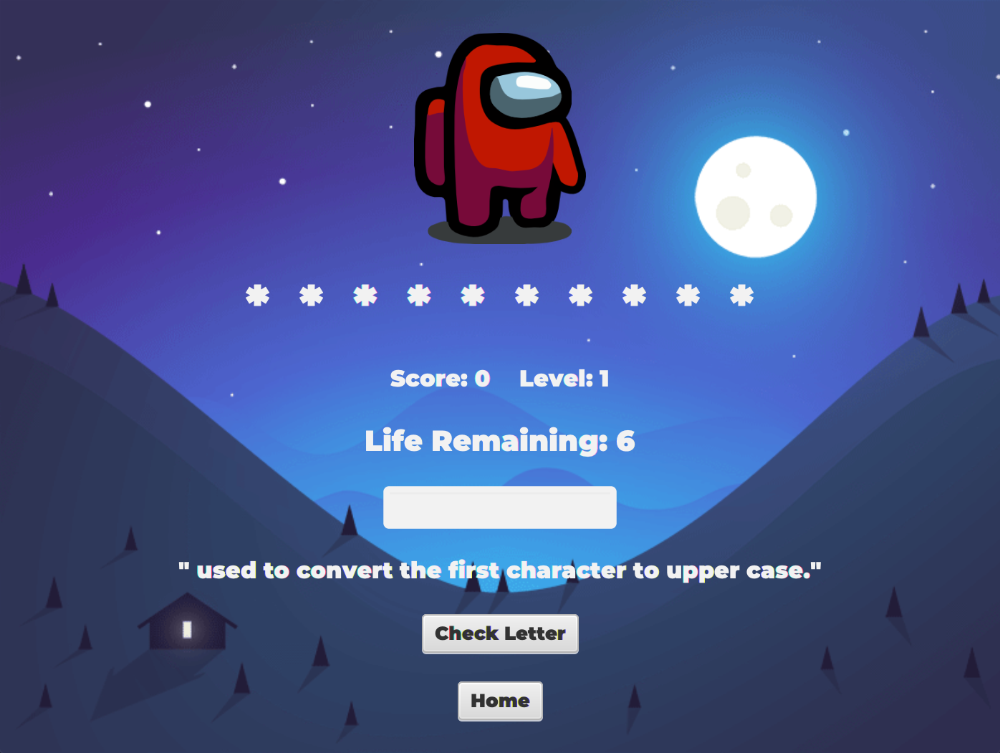
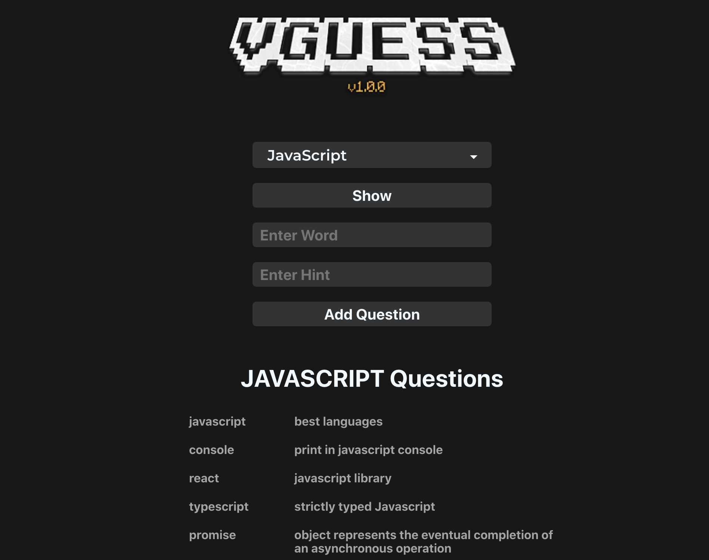

 

    
  </a>

## 🚀 Getting Started

### 👨🏽‍💻 Prerequisites

Nodejs Installed
JavaFx Installed

### 🥁 Stack Used:

    
  </a>

1. Java : Application and GUI
2. JavaFx : Java GUI Library
3. ReactJS : Database Managment System
4. SQL : Database
5. Nodejs : Rest API

`client` directory : has all React Code.

`Java` direcrory : has all JavaFx & Java Code.

`server.js` entry point for server.

To setup JavaFx Highly Recommened This Video : [https://youtu.be/BHj6zbH3inI]()

Start Server: `npm run server` // Port 7000
Start React App: `cd client` && `npm run start` // Port 3000

Open the Java Folder in an IDE i used IntelliJ IDEA. And Run the Main Folder now you can see Java Application Running.

    
  </a>

👾 Gameplay :

    
  </a>

    
  </a>

🚀 React Part :

    
  </a>

## 🥰 Group Members

1. [Deepankar Bhade](https://github.com/Deep-Codes)
2. [Mohit Santosh](https://github.com/mohit-cfc)
3. [Kaartik Nayak](https://github.com/kaartik2611)
4. Aman Singh

## 🏗Contributing

Contributions are what make the open source community such an amazing place to be learn, inspire, and create. Any contributions you make are **greatly appreciated**.

1. Fork the Project
2. Create your Feature Branch (`git checkout -b feature/AmazingFeature`)
3. Commit your Changes (`git commit -m 'Add some AmazingFeature'`)
4. Push to the Branch (`git push origin feature/AmazingFeature`)
5. Open a Pull Request

## 📚 License

Distributed under the MIT License. See `LICENSE` for more information.
